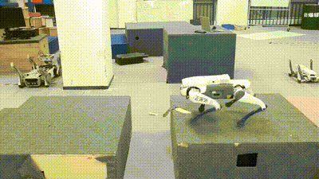

# parkour_lite3_deploy

### Description ###
This is the code for deploy the extreme-parkour in deep robotics lite3.

The training repo: https://github.com/MildCloud/parkour_lite3

### Deploy video ###
<p align="center">

</p>
<p align="center">

</p>

### Usage ###
1. Build for simulation in Raisim
```bash
cmake .. -DBUILD_SIM=ON -DCMAKE_PREFIX_PATH=/home/tianshu/raisimLib-master/raisim/linux
```
2. Build on hardware
```bash
cmake .. --DBUILD_PLATFORM=arm
```
